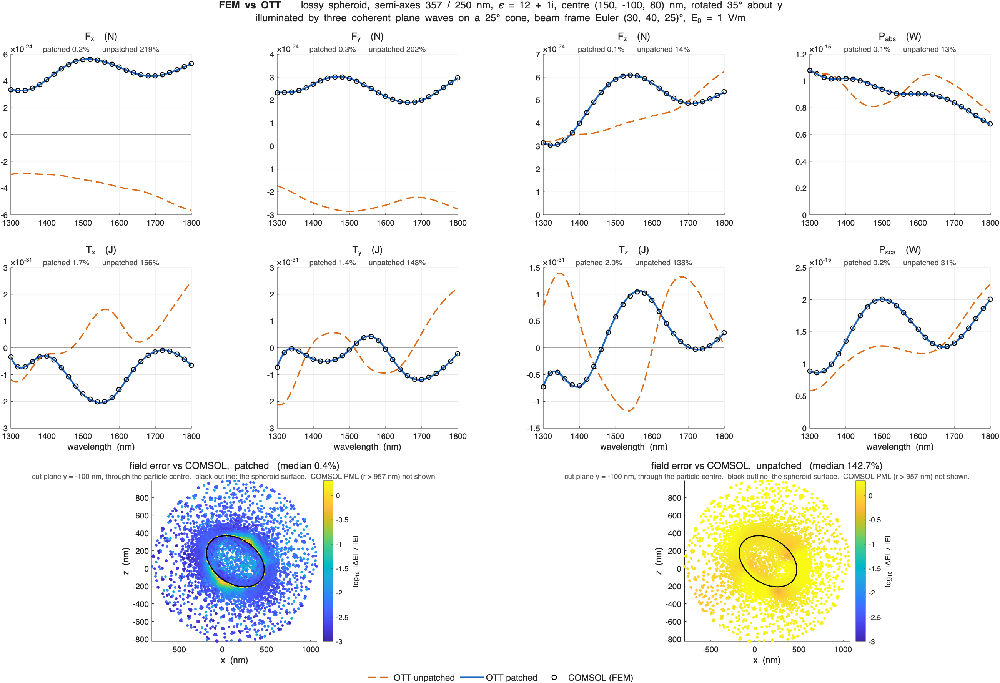

# OTT-Fixed

Three defects repaired in MATLAB OTT, plus two incorrect tests and one incorrect
documentation example.

| | file | |
|---|---|---|
| FIX 1 | `+ott/+utils/spharm.m` | missing Condon–Shortley phase |
| FIX 2 | `+ott/TmatrixSmarties.m` | SMARTIES T-matrix import |
| FIX 3 | `+ott/Bsc.m` | complex wavenumber discarded in field evaluation |

---

## FIX 1 — missing Condon–Shortley phase

`spharm` **omitted** the Condon–Shortley phase. The Legendre routine beneath it,
`legendrerow`, implements the Holmes & Featherstone (2002) recursion from
geodesy, where the phase is conventionally absent, and nothing downstream
restored it. The shipped output therefore differs from the standard harmonic by
a factor `(−1)^m` — measured against the closed forms, the ratio is exactly `−1`
for odd `m` and `+1` for even `m`. `ott.forcetorque` implements Farsund & Felderhof's sums, whose
ladder coefficient `sqrt((n−m)(n+m+1))` *is* the `L₊` matrix element and is
correct only in a basis that carries the phase. Three lines restore it:

```matlab
Y      = Y .* (-1).^mv;
Ytheta = -Ytheta;
Yphi   = -Yphi;
```

**The `(−1)^m` already in `spharm` is a different thing.** `legendrerow` only
computes rows for `|m|`, so a negative-`m` request is handed the same `P_n^|m|`
as its positive twin, and the `(−1)^m` applied to the `m < 0` rows supplies the
negative-order relation that converts one into the other. It applies to `m < 0`
only. Condon–Shortley applies to every `m`. 

**Why only the transverse components broke.** Every term that moves `m` by `±1`
picked up `(−1)^m (−1)^(m±1) = −1`; every term holding `m` fixed was immune. `F_x, F_y, T_x, T_y` negated and `F_z, T_z`
untouched - and only for beams whose coefficients span several `m`, which is why
on-axis beams on axisymmetric particles never showed it.

**Proof.** A sphere in a plane wave must feel a force along `k̂` — symmetry. Unpatched gives `cos 2θ`, the signature of
`F → diag(−1,−1,1)·F`. A sphere never touches `TmatrixSmarties`, so this
isolates FIX 1, and the FIX 2-only column confirms it:

| θ | unpatched | FIX 2 only | FIX 1 only | patched |
|---|---|---|---|---|
| 30° | 0.50000 | 0.50000 | 1.00000 | 1.00000 |
| 45° | 0.00000 | 0.00000 | 1.00000 | 1.00000 |
| 60° | −0.50000 | −0.50000 | 1.00000 | 1.00000 |

## FIX 2 — SMARTIES T-matrix import

`getTmatrixData` unfolded SMARTIES' `|m|` blocks onto `±m` by hand and got two
things wrong: it dropped the `(−1)^(s+s′)` that achirality of a body of
revolution requires for `m < 0`, and it indexed through `meshgrid(rows, cols)`,
whose first output varies along columns — storing every block transposed.
Replaced by SMARTIES' own `sparseTmatrix`, which applies the sign and returns
Nieminen ordering directly. The `internal` option routes the `st4MR` blocks
through the same call.

**Proof — unitarity.** For a lossless particle `S = 2T + I` must be unitary. Unpatched it is not, and refining
`Nmax` does not help; patched it converges. `||S'S − I||/n` at λ = 1064 nm,
unpatched / **patched**:

| a, c (nm) | n_rel | Nmax 6 | Nmax 8 | Nmax 10 |
|---|---|---|---|---|
| 800, 500 | 1.19 | 1.87e−02 / **1.75e−03** | 1.46e−02 / **1.02e−04** | 1.19e−02 / **3.05e−06** |
| 800, 500 | 1.50 | 1.34e−01 / **1.03e−02** | 1.04e−01 / **7.76e−04** | 8.46e−02 / **3.07e−05** |
| 600, 200 | 1.19 | 4.51e−03 / **4.33e−04** | 3.51e−03 / **1.49e−05** | 2.87e−03 / **3.49e−07** |

## FIX 3 — complex wavenumber discarded in field evaluation

`emFieldRtp` scaled positions by `abs(beam.k_medium)`. Inside an absorbing
particle the wavenumber is `k·n_p`, complex, so `abs` removed the attenuation and
the internal field never decayed.

```matlab
rtp(1, :) = rtp(1, :) * beam.k_medium;    % was abs(beam.k_medium)
```


## Two tests and one example that were wrong about the code

Not toolbox defects, but they asserted things the library does not do.

- **`tests/testTmatrixMie.m`** checked boundary continuity with
  `Eext1 = Esca + Einc`, omitting the factor of two that `Bsc.totalField` itself
  applies. It failed by 42 %. With the factor restored it passes.
- **`tests/testForceTorque.m`** called bare `rotz`/`roty`, which live in the
  Phased Array System Toolbox. Now `ott.utils.rotz`/`roty`.
- **`docs/Calculating-Forces-On-A-Spherical-Particle.rst`** plotted the "Total
  field" as `totalField` read in the `regular` basis. A regular expansion has no
  outgoing content at all, so that figure was ~130 % wrong everywhere outside the
  particle. It now evaluates `E_inc + 2*E_sca`.

---

# Validation



## The test system

A lossy spheroid, semi-axes 357 / 250 nm, `ε = 12 + 1i`, centred at
(150, −100, 80) nm and rotated 35° about y.

The illumination is three coherent plane waves: one on axis and two on a 25°
cone at azimuths 0° and 120°, weights `1, e⁻¹, e⁻¹`, each polarised along its own
`θ̂`. The whole triplet is then rotated by `Rz(25°)Ry(40°)Rz(30°)`:

| wave | weight | direction `n` (lab) | polarisation `e` (lab) | angle to `+z` |
|---|---|---|---|---|
| 0 | 1.0000 | (+0.5826, +0.2717, +0.7660) | (+0.3899, +0.7335, −0.5567) | 40.0° |
| 1 | 0.3679 | (+0.6928, +0.5562, +0.4590) | (+0.1072, +0.5500, −0.8283) | 62.7° |
| 2 | 0.3679 | (+0.1846, +0.3192, +0.9295) | (−0.9826, +0.0418, +0.1808) | 21.6° |

`E(r) = Σ w_j ê_j exp(i k n_j·r)`, `E₀ = 1 V/m`. The cone survives the rotation:
waves 1 and 2 remain 25.0° from wave 0 and 42.9° from each other.

Nothing lines up with anything. Three skew directions spread the beam across many
`m`, which is what FIX 1 needs to show at all; the rotated non-spherical particle
is what FIX 2 needs; the loss is what FIX 3 needs. All six force and torque
components are non-zero.

**What this does not cover:** focused beams (`BscPmGauss`), circular
polarisation — all three waves are linear, so `|T|` is only ~9 % of `|F|·a` —
other T-matrix backends, clusters, chiral or magnetic media, and size parameters
beyond `k·a ≈ 1.7`.

## Against COMSOL, 26 wavelengths, absolute SI

| | force | torque | `P_abs` | `P_sca` |
|---|---|---|---|---|
| median relative difference | 0.17 % | 1.34 % | 0.13 % | 0.24 % |

with the force direction agreeing to 0.019°. Neither fix alone suffices — the
ratio COMSOL / OTT, per component:

| | unpatched | FIX 1 only | FIX 2 only | patched |
|---|---|---|---|---|
| `F_x` | −1.1851 | 1.3227 | −1.3147 | 0.9990 |
| `F_y` | −1.0224 | 1.2721 | −1.3813 | 0.9990 |
| `F_z` | 1.1289 | 1.2979 | 1.1984 | 0.9994 |
| `T_x` | −0.2229 | −0.3845 | −0.3611 | 0.9908 |
| `T_y` | −0.3927 | −0.1312 | 0.0168 | 0.9979 |
| `T_z` | −0.3441 | −0.1171 | −0.3347 | 0.9866 |
| `P_sca` | 1.3105 | 1.3202 | 1.6170 | 0.9991 |
| `\|ΔF\|/\|F\|` | 1.59 | 0.30 | 1.68 | **0.0017** |
| angle(F) | 93.5° | 2.1° | 92.2° | **0.019°** |

FIX 1 sets the direction, FIX 2 the magnitude.

Note which quantities the unpatched build gets *plausibly* wrong rather than
obviously wrong: `F_z` by 14 %, `P_abs` by 13 %, `P_sca` by 31 % — right sign,
right shape. A lone `F_z` sweep looks fine. `F_x` and `F_y` at 200 % with the
wrong sign are the ones anyone would notice.

The bottom row of the figure is the field on the plane `y = −100 nm` through the
particle centre at λ = 1800 nm, as `log₁₀` of the relative difference from
COMSOL on a shared scale. The patched build sits at the 0.1 % floor except for a
thin band tracing the particle surface — the region between the inscribed
(250 nm) and circumscribed (357 nm) spheres, where neither the regular nor the
outgoing series lies inside its own convergence ball.

## Other checks

None of these compares one of these implementations against another.

| test | result |
|---|---|
| force from OTT's sums vs analytic Mie vs Maxwell stress tensor | agree to `1e−6` |
| internal T-matrix, `P_abs` internal vs external route, spheroid | unpatched 1.50–1.99, patched `1.000000` |
| the same test on a sphere | `1.000000` on both — the sphere limit is blind to FIX 2 |
| COMSOL cut plane, inside / outside the particle | 0.48 % / 0.37 % median |
| beam vs closed-form three-wave sum | `2.3e−14` |
| background field, COMSOL vs analytic vs OTT | OTT `2.3e−14`; COMSOL `1.8e−02`, its export interpolation, scaling as `0.5(kh)²` |
| OTT's own test suite | unpatched 22 failures, patched 21 — the one that changes is `testTmatrixMie/testFields`. None of the rest involve the physics touched here: 12 are `ott.TmatrixDda` calling `memory`, a Windows-only function; 6 test `ott.utils.col3to1`, `interaction_A` and `rotate_polarizability`, which do not exist in this version; 1 is a bare `rotz` in `testExamples.m:180`; 1 (`testTmatrix/testShrinkPowerWarning`) passes in isolation and fails only because `testExamples` and `testFindTraps` call `ott.change_warnings('off')` without restoring it; and 1 (`testForceTorque/testCoherent`) is a genuine upstream bug unrelated to this patch — `forcetorque.m:137` calls `mergeBeams`, which is defined nowhere, so the `'coherent'` path throws |

## What was already correct

The phase is a basis gauge change, so most of the toolbox is invariant, and the
SMARTIES defect only reaches non-spherical particles.

- **All field evaluation, far fields, cross sections and `power`** — unaffected
  by FIX 1; a gauge change on the basis is cancelled by the same change on the
  coefficients.
- **`F_z` and `T_z` everywhere**, and **on-axis beams on axisymmetric
  particles** — the immune `m ↔ m` family.
- **Axial and lateral trap stiffness with an on-axis beam.** The two defects
  cancel: the beam is placed on the wrong side *and* `F_x` is negated. The
  lateral force curve is identical in both builds to `0.000e+00`. Trap sweeps
  and `axial_equilibrium` were never wrong.
- **`translateZ`, `rotateZ`** — `rotateZ` commutes with the phase; `translateZ`
  never enters the rotation path.
- **`TmatrixMie` and `TmatrixEbcm`**, and every sphere result — FIX 2 is in the
  SMARTIES importer only.
- **Internal fields of lossless particles** — FIX 3 needs `Im(k) ≠ 0`.

What was wrong is narrower than it first looks: beams **constructed** at an
angle, rotated non-axisymmetric particles, the **position** of a laterally
translated beam if you looked at its field, and internal fields of absorbing
particles. Scripts that compensated for the old convention must drop the
workaround.

`translateXyz` was internally inconsistent and is fixed as a consequence, not by
design: `wigner_rotation_matrix` never reads `spharm`, so the basis moved under
it. Requesting `+0.3λ` unpatched moved the beam to `+0.3` along x but `−0.3`
along z. Patched, all axes obey one rule to `5e−15`.

---

# Notes and traps

Not defects — conventions that are easy to get wrong, each of which cost real
time while this patch was being validated.

## Plane-wave polarisation is read in the frame of the angles you pass

`ott.BscPlane(θ, φ, 'polarisation', [p_θ p_φ])` makes a wave travelling along
**−n(θ,φ)** — the angles name where it comes *from* — and reads `[p_θ p_φ]` in
the `θ̂`/`φ̂` frame **at those angles**. Resolving the polarisation at the
*propagation* angles instead silently negates the `φ̂` component, because

```
theta_hat(pi−t, p+pi) = theta_hat(t, p)      but      phi_hat(p+pi) = −phi_hat(p)
```

That builds a different beam, not a rescaled one, and nothing errors. For a
lab-frame direction `n` and polarisation `e`:

```matlab
m  = -n;                            % the direction it comes from
th = acos(m(3));  ph = atan2(m(2), m(1));
that = [cos(th)*cos(ph); cos(th)*sin(ph); -sin(th)];
phat = [-sin(ph); cos(ph); 0];
b = 1i*ott.BscPlane(th, ph, 'polarisation', [dot(that,e), dot(phat,e)], ...);
```

The leading `1i` cancels a constant `−i` that `BscPlane` applies; it is
irrelevant for a single beam and matters when summing several.

## Rotation and translation

`beam.rotate(R)` rotates the **frame** by `R`, i.e. the field by `R⁻¹`: a wave
along `+z` rotated by `roty(35)` ends up along `inv(R)·ẑ`, not `R·ẑ`.

`Bsc.scatter` applies `rotate(R)`, then `T`, then `rotate(inv(R))`, so the net
operator is `D(R) T D(R⁻¹)` and **`'rotation', R` means the particle sits at
`R`** — `ott.utils.roty(35)` is a particle rotated `+35°` about y.

`forcetorque(..., 'rotation', R)` does the whole round trip internally and
returns lab-frame vectors. Frames only become your problem if you evaluate
fields yourself: after `beam.translateXyz(rc).rotate(R)` the coefficients live in
the particle frame, so lab points must be mapped in and field vectors mapped back
out.

## The surrounding medium must be lossless

Nothing in upstream OTT checked this. `parser_k_medium` accepted a complex
`index_medium` and passed it straight through, and the result looks plausible.
With the particle held **lossless**, so that energy conservation demands
`Csca/Cext = 1` exactly:

| `index_medium` | `F_z` | `Csca/Cext` |
|---|---|---|
| 1.33 | 1.217961e+01 | 1.000000 |
| 1.33 + 0.01i | 8.148070e+00 | 1.097072 |
| 1.33 + 0.1i | −3.919459e+01 | 4.181885 |
| 1.33 + 1i | −5.622686e+04 | 1083.589663 |

The force flips sign and grows by 4600×, and energy conservation is violated by
three orders of magnitude, silently. The reason is physical: the force sums
integrate the stress tensor over a sphere enclosing the particle, which gives the
force *on the particle* only if nothing in between absorbs. With a lossy host the
answer depends on the integration radius, and the VSWF orthogonality the sums
rely on no longer holds — there is no well-defined force to compute.

`ott.Tmatrix.parser_k_medium` and `ott.Bsc.parser_k_medium` now warn
(`ott:Tmatrix:parser_k_medium:lossy_medium`) when `k_medium` is complex. Fields
are still evaluated correctly in that case — see FIX 3 — which is precisely why
the warning is needed: after the patch a lossy host *looks* supported.

## What the field objects mean

`basis` is the radial function; `type` is a label on the coefficients. They are
independent, and `set.basis` only relabels — it does not convert.

`ott.utils.emField` evaluates the outgoing and incoming bases as **`h1/2`** and
**`h2/2`**, not `h1` and `h2` (`emField.m:99,104`), so that

```
regular = outgoing + incoming
```

rather than the textbook `j = (h1 + h2)/2`. This is deliberate: it makes the
incoming and outgoing halves of a regular beam carry the *same* coefficients, so
`S = 2T + I` follows directly. The price is that **`emFieldXyz` on a `scattered`
beam returns half the physical scattered field**.

The T-matrix itself is the ordinary one — for a sphere its diagonal reproduces
the Bohren–Huffman coefficients to `4e−16`, and `S = 2T + I` is unitary to
`2e−16` when lossless. The factor of two is in the basis, not in `T`.

`totalField(ibeam)` returns `2*beam + ibeam`, which is the **outgoing half** of
the total field, `S·a`. It is not the total field on its own: a single `Bsc`
cannot hold both halves. `scatteredField` is its exact inverse, `0.5*(beam −
ibeam)`.

Two ways to evaluate the total field outside the particle:

```
A   E_inc(basis 'regular')  + 2 * E_sca(basis 'outgoing')
B   E_inc(basis 'incoming') +     totalField(basis 'outgoing')
```

Both are correct; write the factor of two in exactly one of them. **Use A.** In B
the incoming half is ~1e12 times the answer it helps produce, so it is pure
cancellation and loses every digit as `Nmax` grows — `0.0037` at Nmax 10 against
`1.0000` at Nmax 20, for the same physics.

Against a full-wave solver in the scattered-field formulation:

| COMSOL | outside the particle | inside |
|---|---|---|
| `ewfd.E` (total) | `E_inc + 2*E_sca` | `E_int` |
| `ewfd.relE` (relative) | `2*E_sca` | `E_int − E_inc` |

The internal beam carries no factor of two, and its wavenumber is the particle's,
`k·n_p`. COMSOL solves `exp(+jωt)` against OTT's `exp(−iωt)`, so the two differ
by a complex conjugate.
